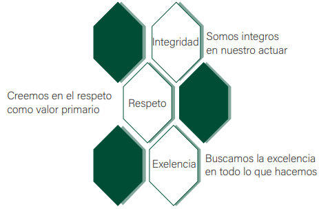

<!DOCTYPE html>
<html lang="es">

<head>
  <meta charset="utf-8">
  <title>PAA Asociados</title>
  <meta content="width=device-width, initial-scale=1.0" name="viewport">
  <meta content="" name="keywords">
  <meta content="" name="description">

  <meta property="og:title" content="">
  <meta property="og:image" content="">
  <meta property="og:url" content="">
  <meta property="og:site_name" content="">
  <meta property="og:description" content="">

  <meta name="twitter:card" content="summary">
  <meta name="twitter:site" content="">
  <meta name="twitter:title" content="">
  <meta name="twitter:description" content="">
  <meta name="twitter:image" content="">

  <link href="favicon.ico" rel="shortcut icon">

  <link href="https://fonts.googleapis.com/css?family=Open+Sans:300,300i,400,400i,700,700i|Raleway:300,400,500,700,800" rel="stylesheet">

  <link href="bootstrap.min.css" rel="stylesheet">

  <link href="font-awesome.min.css" rel="stylesheet">
  <link href="animate.min.css" rel="stylesheet">
  
    
 <link href="style.css" rel="stylesheet"> 

</head>

<body>
  

  <section id="hero">
    

      

        

          
        

        <h1>Bienvenidos a Palomeque & Acosta Asociados</h1>
        <h2>Somos Abogados, Escribanos, Contadores, más</h2>
        

          <a href="#about" class="btn-get-started">Empezar</a>
          <a href="#services" class="btn-services">Otros Servicios</a>
        

      

    

  </section>

 
  <header id="header">
    

      

        <a href="#hero"></img></a>
        <!--<h1><a href="#hero">Header 1</a></h1>-->
      

      <nav id="nav-menu-container">
        <ul class="nav-menu">
          <li class="menu-active"><a href="#hero">Inicio</a></li>
          <li><a href="#about">Nuestros Valores</a></li>
          <li><a href="#services">Areas</a></li>
          <li><a href="#portfolio">Real State</a></li>
          <li><a href="#testimonials">Nosotros</a></li>
          <li><a href="#contact">Contacto</a></li>
          <!-- <li class="menu-has-children"><a href="">Drop Down</a>  -->
            <ul>
              <!-- <li><a href="#">Drop Down 1</a></li>
              <li class="menu-has-children"><a href="#">Drop Down 2</a>
                <ul>
                  <li><a href="#">Deep Drop Down 1</a></li>
                  <li><a href="#">Deep Drop Down 2</a></li>
                  <li><a href="#">Deep Drop Down 3</a></li>
                  <li><a href="#">Deep Drop Down 4</a></li>
                  <li><a href="#">Deep Drop Down 5</a></li>
                </ul>
              </li>
              <li><a href="#">Drop Down 3</a></li>
              <li><a href="#">Drop Down 4</a></li>
              <li><a href="#">Drop Down 5</a></li> -->
            <!-- </ul>
          </li>
          <li><a href="#contact">Contact Us</a></li> -->
        </ul>
      </nav>
      <!-- #nav-menu-container -->
    

  </header>
  <!-- #header -->

  
  <section id="about">
    

      

        

          <h3 class="section-title">Nuestros Valores</h3>
          

          

        

      

    

    

      

        

          
        

        

          <h2 class="about-title"></h2>
          

            Prestamos servicios jurídicos de confianza y calidad, buscamos la tranquilidad y seguridad de nuestros clientes que tienen la certeza de que se les brindará una solución rápida y eficaz a sus requerimientos.

          

          

            Dichos servicios se prestan en estricto cumplimiento de valores tales como integridad, respeto y excelencia.

          

          

          

        

      

    

  </section>

  
  <section id="services">
    

      

        

          <h3 class="section-title">Areas</h3>
          

          
Contamos con un equipo legal de primer nivel, prestando servicios al derecho corporativo, nos especializamos en diferentes areas.

        

      

      

        

          
<i class="fa fa-desktop"></i>

          <h4 class="service-title"><a href="">Derecho Civil</a></h4>
          
El derecho civil es la rama del derecho privado que regula las principales relaciones civiles de las personas, las relaciones familiares, la propiedad y los demás derechos reales, las obligaciones y contratos, y las sucesiones.

        

        

          
<i class="fa fa-bar-chart"></i>

          <h4 class="service-title"><a href="">Derecho Corporativo</a></h4>
          
El derecho corporativo se centra en las empresas y en su todo lo relacionado con ellas desde un punto de vista legal, es decir, las distintas clases de sociedades, la relación de la empresa con los consumidores, el análisis de la tributación o la contratación mercantil.

        

        

          
<i class="fa fa-paper-plane"></i>

          <h4 class="service-title"><a href="">Derecho Laboral</a></h4>
          
El derecho laboral es formada por un conjunto de normas jurídicas que se establecen en la relación entre los trabajadores y los empleadores. Lo constituyen preceptos de orden público y legal, que se basan en la premisa de asegurarle a quien trabaja un pleno desarrollo como persona y una integración real a la sociedad.

        

        

          
<i class="fa fa-photo"></i>

          <h4 class="service-title"><a href="">Derecho Societario</a></h4>
          
El Derecho societario o Derecho empresarial es la rama del Derecho privado que se ocupa del empresario social, es decir, la sociedad como sujeto del tráfico empresarial.

        

        

          
<i class="fa fa-road"></i>

          <h4 class="service-title"><a href="">Derecho Administrativo</a></h4>
          
El derecho administrativo es la rama del derecho público que regula la organización, funcionamiento, poderes y deberes de la Administración pública y las consiguientes relaciones jurídicas entre la Administración y otros sujetos.

        

        

          
<i class="fa fa-shopping-bag"></i>

          <h4 class="service-title"><a href="">Real Estate y Servicios Notariales</a></h4>
          
Este sector abarca el mercado inmobiliario de compra y venta de propiedades y los servicios notariales.

        

      

    

  </section>

  
  <section id="subscribe">
    

      

        

          <h3 class="subscribe-title">Seguinos para mas novedades</h3>
          
Nos podes seguir en nuestras redes para estar al tanto de las ultimas noticias.

        

        

          <a class="subscribe-btn" href="https://www.instagram.com/gastonacostaveglia/?hl=es-la" target="_blank">Seguinos</a>
        

      

    

  </section>

  <section id="portfolio">
    

      

        

          <h3 class="section-title">Real State</h3>
          

          
Nuestro equipo se encarga de los negocios inmobiliarios, propiedad a la venta:

        

      

      

        

          <a class="portfolio-item" style="background-image: url(plano1.png);" href="plano1.png" target="_self">
            

              <!-- <h4>Portfolio 1</h4>
              Alored dono par -->
            

          </a>
        

        

          <a class="portfolio-item" style="background-image: url(plano\ 2.png);" href="plano 2.png">
            

              <!-- <h4>Portfolio 2</h4>
              Alored dono par -->
            

          </a>
        

        

          <a class="portfolio-item" style="background-image: url(plano\ 3.png);" href="plano 3.png">
            

              <!-- <h4>Portfolio 3</h4>
              Alored dono par -->
            

          </a>
        

        

          <a class="portfolio-item" style="background-image: url(plano4\ \(2\).png);" href="plano4 (2).png">
            

              <!-- <h4>Portfolio 4</h4>
              Alored dono par -->
            

          </a>
        

        

          <a class="portfolio-item" style="background-image: url(plano4.png);" href="plano4.png">
            

              <!-- <h4>Portfolio 5</h4>
              Alored dono par -->
            

          </a>
        

        

          <a class="portfolio-item" style="background-image: url(palno5.png);" href="palno5.png">
            

              <!-- <h4>Portfolio 6</h4>
              Alored dono par -->
            

          </a>
        

        

          <a class="portfolio-item" style="background-image: url(plano6.png);" href="plano6.png">
            

              <!-- <h4>Portfolio 7</h4>
              Alored dono par -->
            

          </a>
        

        

          <a class="portfolio-item" style="background-image: url(plano7.png);" href="plano7.png">
            

              <!-- <h4>Portfolio 8</h4>
              Alored dono par -->
            

          </a>
        

      

    

  </section>

 
  <section id="testimonials">
    

      

        

          <h3 class="section-title">Nosotros</h3>
          

          
Nuestro equipo de profesionales brinda asesoramiento a nuestros clientes, dando un servicio de calidad, lo que da como resultado una solución acorde, global y personalizada.

        

      

      

        

          

            

            <h4>Joaquín Palomeque Stewart</h4>
            Doctor en Derecho - Universidad Católica del Uruguay
          

        

        

          

            <b></b>Lorem ipsum dolor sit amet consectetur adipisicing elit. Tenetur, deserunt. Lorem ipsum dolor sit amet consectetur adipisicing elit. At, quod. Lorem ipsum dolor sit amet consectetur adipisicing elit. Totam, expedita.<small></small>
          

        

      

      

        

          

            <b></b>Lorem ipsum dolor sit, amet consectetur adipisicing elit. Ea, tempora? Lorem ipsum dolor sit amet consectetur, adipisicing elit. Provident nobis, autem illum libero velit iste doloribus molestiae quaerat pariatur eligendi? <small></small>
          

        

        

          

            

            <h4>Gastón Acosta Veglia</h4>
            Doctor en Derecho - Universidad de la República
          

        

      

    

  </section>
  <!--==========================
  Team Section
  ============================-->
  <!-- <section id="team">
    

      

        

          <h3 class="section-title">Our Team</h3>
          

          
Sed ut perspiciatis unde omnis iste natus error sit voluptatem accusantium doloremque

        

      

      

        

          

            

            <h4>Walter White</h4>
            Chief Executive Officer
            

              <a href=""><i class="fa fa-twitter"></i></a>
              <a href=""><i class="fa fa-facebook"></i></a>
              <a href=""><i class="fa fa-google-plus"></i></a>
              <a href=""><i class="fa fa-linkedin"></i></a>
            

          

        

        

          

            

            <h4>Sarah Jhinson</h4>
            Product Manager
            

              <a href=""><i class="fa fa-twitter"></i></a>
              <a href=""><i class="fa fa-facebook"></i></a>
              <a href=""><i class="fa fa-google-plus"></i></a>
              <a href=""><i class="fa fa-linkedin"></i></a>
            

          

        

        

          

            

            <h4>William Anderson</h4>
            CTO
            

              <a href=""><i class="fa fa-twitter"></i></a>
              <a href=""><i class="fa fa-facebook"></i></a>
              <a href=""><i class="fa fa-google-plus"></i></a>
              <a href=""><i class="fa fa-linkedin"></i></a>
            

          

        

        

          

            

            <h4>Amanda Jepson</h4>
            Accountant
            

              <a href=""><i class="fa fa-twitter"></i></a>
              <a href=""><i class="fa fa-facebook"></i></a>
              <a href=""><i class="fa fa-google-plus"></i></a>
              <a href=""><i class="fa fa-linkedin"></i></a>
            

          

        

      

    

  </section> -->
  <section id="contact">
    

      

        

          <h3 class="section-title">Contacto</h3>
          

          
En caso de tener alguna duda o consulta sobre nuestros servicios, comunicate por cualquiera de nuestras vias.

        

      

      

        

          

            

              <i class="fa fa-map-marker"></i>
              
Plaza Independecia 1324 Montevideo, Uruguay

            

            

              <i class="fa fa-envelope"></i>
              
pa.asociados2020@gmail.com

            

            

              <i class="fa fa-phone"></i>
              
(+598) 099665722 / 099109936

            

          

        

        

          

            
Your message has been sent. Thank you!

            

            <form action="" method="post" role="form" class="contactForm">
              

                <input type="text" name="name" class="form-control" id="name" placeholder="Your Name" data-rule="minlen:4" data-msg="Please enter at least 4 chars" />
                

              

              

                <input type="email" class="form-control" name="email" id="email" placeholder="Your Email" data-rule="email" data-msg="Please enter a valid email" />
                

              

              

                <input type="text" class="form-control" name="subject" id="subject" placeholder="Subject" data-rule="minlen:4" data-msg="Please enter at least 8 chars of subject" />
                

              

              

                <textarea class="form-control" name="message" rows="5" data-rule="required" data-msg="Please write something for us" placeholder="Message"></textarea>
                

              

              
<button type="submit">Send Message</button>

            </form>
          

        

      

    

  </section>

 
  <footer id="footer">
    

      

        

          

            &copy; Copyright <strong>PAA Asociados</strong>. Todos los derechos reservados.
          

          

            
            Montevideo 2020 
          

        

      

    

  </footer>

  <a href="#" class="back-to-top"><i class="fa fa-chevron-up"></i></a>

  
  
  
  
  
  
  
  

    

  

</body>

</html>
